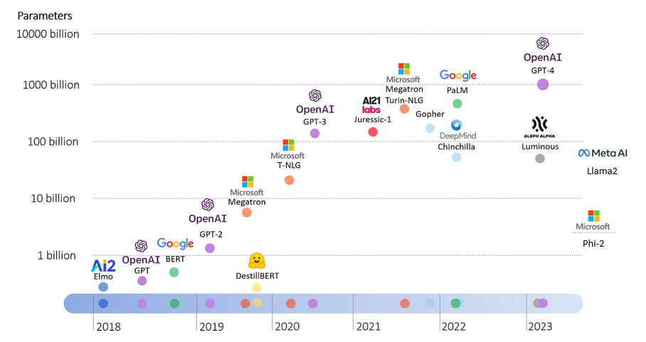
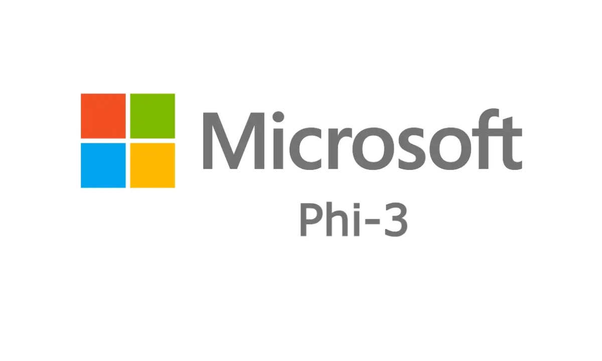
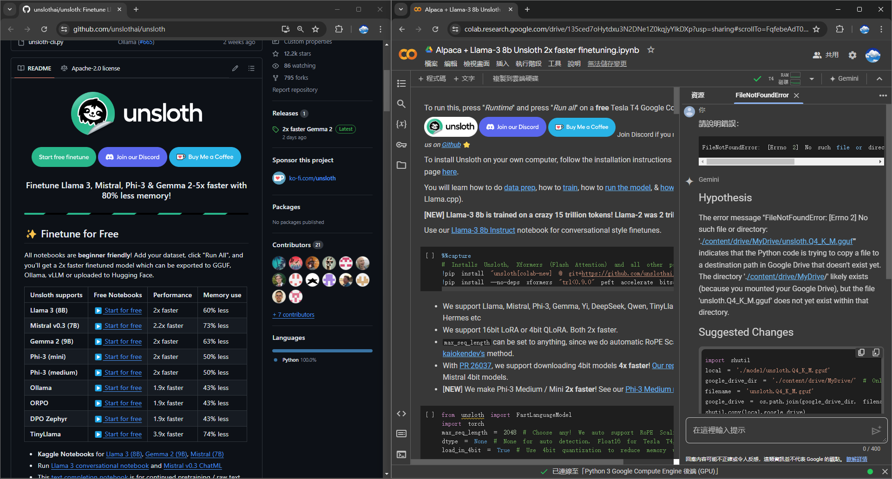

---
marp: true
paginate: true
footer: Edge `AI`
---

<!-- _class: invert -->


# Edge AI ✨
###
```powershell
🤖 AI processing on local devices
```
##### `OAD` **brian_li**

---


# **A**genda

- Edge AI
- Open Source Model
- Ollama
- Open WebUI
- Unsloth
- LLM Tools
- Taiwan Llama
- Live Demo

---


# Edge **AI**

###### 允許數據在**本地**進行處理，而不需傳輸到雲端服務
###
- 低延遲：即時反應
- 安全性：本地處理數據
- 可靠性：網絡中斷仍可運行
###
⚠️ 性能表現依賴本地設備

---


# **Open** Source `vs` **Close** Models

|特點|開源模型|閉源模型|
|:-:|:-:|:-:|
|**可用性**|免費、公開|需購買或授權|
|**擴充性**|可自由修改、擴展|依賴提供者|
|**透明度**|高，公開源碼|低，不公開|
|**安全性**|可檢查漏洞|依賴提供者|
|**社群支援**|大量社群、更新快|無|
|**依賴性**|不依賴單一提供者|高度依賴提供者|
|**舉例**|`llama3` `gemma2` `phi3`|`gpt4o` `sonnet`|

---



---


# **O**llama 

https://ollama.com/

- 一個開源工具
- 允許在本地運行各種開源 LLM
- 支援 GPU 加速 (如果有)
- 允許微調模型或創建自定義模型
- 支援 CLI 操作
- 提供 REST API

---


# Risks of **Close** Model

OpenAI `GPT4o`、Anthropic `Sonnet`

- **無法避免資料訓練**
  Prompt
  Document

- **完全依賴網路**
  中斷
  延遲

>⚠️服務商持有控制權

---

# 常見**開源**模型

||||||
|:-:|:-:|:-:|:-:|:-:|
|Meta|Mistrel AI|Google|Microsoft|Alibaba|
|**llama3**|**mistral**|**gemma2**|**phi3**|**qwen2**|
|`8B` `70B`|`7B`|`9B` `27B`|`3B` `14B`|`0.5B` `1.5B` `7B` `72B`|
###
> `B` = `Billion` 十億，代表模型參數(Parameters)數量，例如 GPT-3 為 `175B`

---


# **O**llama - CLI
###

```sh
# 檢視版本
ollama -v

# 下載模型，如需指定參數請用例如 llama3:8b
ollama pull llama3

# 與 AI 互動
ollama run llama3 "Why is the sky blue?"

# 其他指令查詢
ollama -h
```
###

>其他指令操作可參考[線上說明](https://github.com/ollama/ollama?tab=readme-ov-file#cli-reference)

---


# **O**llama - API

###

```sh
# 使用 curl 呼叫 API

curl -X POST http://localhost:11434/api/generate -d '{
  "model": "llama3",
  "prompt":"Why is the sky blue?"
 }'
```

###

- 詳細 API 端點資訊請 [參考文件](https://github.com/ollama/ollama/blob/main/docs/api.md)
- 也可使用 `Postman` 或 `*.http` 測試

###

>💡應用程式可透過 API 與 model 互動

---


# Open Web**UI**

https://openwebui.com/

- 支援 Ollama = 可用開源 LLM
- 支援 OpenAI = 可用 GPT4o
- 類似 ChatGPT，學習曲線低
- 支援檔案上傳、檔案管理保存
- 支援RAG，可搜尋網頁或檔案
- 可自訂 AI 模型(類似GPTs)
- 支援語音輸入與輸出
- 支援多模型提問
- 可上傳自訓練模型(GGUF)

---

<!-- _class: invert -->


---


# RAG **vs** Fine-Tuning

🧑‍🎨`小明`收藏了整套哈利波特，完整閱讀過，大概知道章節與內容

👩‍🦰`小美`熟讀了整套哈利波特，內容到背如流，後來將書捐贈出售
###
👨`小華`請教🧑‍🎨`小明`哈利波特內容，🧑‍🎨`小明`快速查閱找到答案

👨`小華`請教👩‍🦰`小美`哈利波特內容，👩‍🦰`小美`不加思索立刻回答
###
🧑‍🎨`小明`就是 **RAG** (Retrieval-Augmented Generation)

👩‍🦰`小美`就是 **Fine-Tuning**

###

>後來 J.K.羅琳 決定推出哈利波特新系列.... 🧑‍🎨 `vs` 👩‍🦰將會?

---


https://unsloth.ai/

- 快速微調和訓練 LLM 的開源工具
- 訓練速度較其它工具快，使用記憶體低
- 支援 `NVIDIA` `AMD` `Intel` 等 GPU
- 在 Google Colab 即可免費訓練*
- GGUF 可導入 OpenWebUI 使用

###

> *⚠️免費僅限單CPU，模型不可過大

---

<!-- _class: invert -->



---

<!-- _backgroundColor: #ddd -->


|   | `1` ChatGPT | `2` Open Source Model | `3` API |`4` SGSGPT|
|--:|:-------:|:-----------------:|:---:|:----:|
|方案|Teams|Ollama + Open WebUI|API + Open WebUI|SGS員工|
|費用(NT)|23,334/年|50,000(單次)|20,000(單次)|總公司支付|
|功能|⭐⭐⭐|⭐⭐⭐|⭐⭐⭐|⭐|
|離線使用|🔴|🟢|🔴|🔴|
|隱私安全|🔴|🟢|🔴|🟠|
|優點|功能最新|管控與安全性最高|同`1`但費用更少|安全?|
|缺點|費用高|依賴硬體、自行維運|自行維運|功能最少|
|帳號數量|2|∞|∞|依申請|

---


# LLM **Tools** 

https://lmstudio.ai/
https://useanything.com/

- Support Open Source Models
- Running model as API service
- Chat with Model
- Support OpenAI API
- Support Azure OpenAI Service

>At least 8G RAM for `7B` model, 16G for `13B`, and 32G for `33B`

---


# Taiwan Llama 3

https://github.com/MiuLab/Taiwan-LLM

- 台大資工　林彥廷博士製作
- 基於 Meta Llama-3 模型
- 使用繁體中文語料庫 Fine-Tuning
- TMLU 測試 `70B` 優於 Claude3、GPT4o
- 於台灣本地知識、法律等領域表現優異
- 整體性能優於原始 Llama 3 模型
- 企業(單次)訓練成本仍然偏高

>find more LLMs on [HuggingFace](https://huggingface.co/) 

---


# Home**work**

>🚨自由練習，不強制
>⚠️注意AI表現會與電腦硬體相關

- 前往以下網址註冊帳號 (需審核)
  http://10.213.125.140/
- 嘗試進行幾項測試
  - 與AI對談，詢問任何問題
  - 上傳檔案，討論檔案內容
  - 其他深度操作
- 安裝一套 LLM Tool，並嘗試使用
- 嘗試更多的開源模型

---


# 😀 Thank you !
feel free to ask if you have any other questions.
##
> **OAD** / brian_li / #1429
brian.li@sgs.com